# This is main branch with project description.
## Projects itself in other branches of this repo.

|  #  | Project  | Demo          |Thumbnail|
| :-: | -------- | ------------- |---------|
|01| [Feedback app](https://github.com/xml12333/reactJS/tree/01-feedback-app)| [Demo](https://nikt-feedback-app.netlify.app/)| |
|02| [Github finder app](https://github.com/xml12333/reactJS/tree/02-github-finder-app)| [Demo](https://nikt-github-finder-app.netlify.app/)| 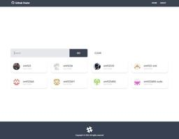|
|03| [Qr code generator](https://github.com/xml12333/reactJS/tree/03-qr-code-generator)| [Demo](https://nikt-qr-code-generator.netlify.app/)| |
|04| [News letter email page](https://github.com/xml12333/reactJS/tree/04-news-letter-email-page)| [Demo](https://nikt-news-letter-email-page.netlify.app/)| |
|05| [Hiragana quiz](https://github.com/xml12333/reactJS/tree/05-hiragana-quiz)| [Demo](https://nikt-hiragana-quiz.netlify.app/)| |
|06| [Recipe app](https://github.com/xml12333/reactJS/tree/06-recipe-app)| [Demo](https://nikt-recipe-app.netlify.app/)| |
|07| [Drumkit](https://github.com/xml12333/reactJS/tree/07-drumkit)| [Demo](https://nikt-drumkit.netlify.app/)| |
|08| [Calculator](https://github.com/xml12333/reactJS/tree/08-calculator)| [Demo](https://nikt-calculator.netlify.app/)| 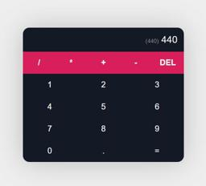|
|09| [Wiki search](https://github.com/xml12333/reactJS/tree/09-wiki-search)| [Demo](https://nikt-wiki-search.netlify.app/)| |
|10| [Quote generator](https://github.com/xml12333/reactJS/tree/10-quote-generator)| [Demo](https://nikt-quote-generator.netlify.app/)| |
|11| [Movie](https://github.com/xml12333/reactJS/tree/11-movie)| [Demo](https://nikt-movie.netlify.app/)| |
|12| [Accordion](https://github.com/xml12333/reactJS/tree/12-accordion)| [Demo](https://nikt-accordion.netlify.app/)| |
|13| [Pokemon catch](https://github.com/xml12333/reactJS/tree/13-pokemon-catch)| [Demo](https://nikt-pokemon-catch.netlify.app/)| 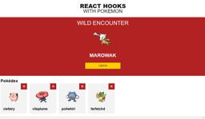|
|14| [Reddit feed](https://github.com/xml12333/reactJS/tree/14-reddit-feed)| [Demo](https://nikt-reddit-feed.netlify.app/)| |
|15| [Student list](https://github.com/xml12333/reactJS/tree/15-student-list)| [Demo](https://nikt-student-list.netlify.app/)| |
|16| [Q and a](https://github.com/xml12333/reactJS/tree/16-q-and-a)| [Demo](https://nikt-q-and-a.netlify.app/)| 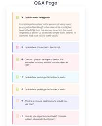|
|17| [Income tracker](https://github.com/xml12333/reactJS/tree/17-income-tracker)| [Demo](https://nikt-income-tracker.netlify.app/)| |
|18| [Login form](https://github.com/xml12333/reactJS/tree/18-login-form)| [Demo](https://nikt-login-form.netlify.app/)| |
|19| [Drag and drop](https://github.com/xml12333/reactJS/tree/19-drag-and-drop)| [Demo](https://nikt-drag-and-drop.netlify.app/)| |
|20| [Ecommerce](https://github.com/xml12333/reactJS/tree/20-ecommerce)| [Demo](https://nikt-ecommerce.netlify.app/)| |
|21| [Dashboard](https://github.com/xml12333/reactJS/tree/21-dashboard)| [Demo](https://nikt-dashboard.netlify.app/)| 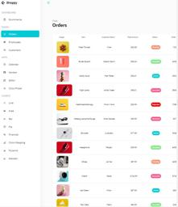|
|22| [Filmpire](https://github.com/xml12333/reactJS/tree/22-filmpire)| [Demo](https://nikt-filmpire.netlify.app/)| 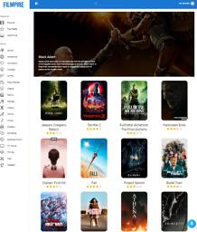|
|23| [Ecommerce2](https://github.com/xml12333/reactJS/tree/23-ecommerce2)| [Demo](https://nikt-ecommerce2.netlify.app/)| 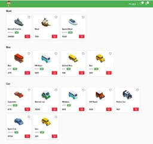|
|24| [Metaverse](https://github.com/xml12333/reactJS/tree/24-metaverse)| [Demo](https://nikt-metaverse.netlify.app/)| 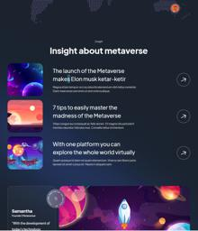|
|25| [Gpt3](https://github.com/xml12333/reactJS/tree/25-gpt3)| [Demo](https://nikt-gpt3.netlify.app/)| 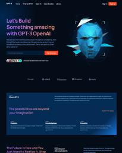|
|26| [Shareme](https://github.com/xml12333/reactJS/tree/26-shareme)| [Demo](https://nikt-shareme.netlify.app/)| 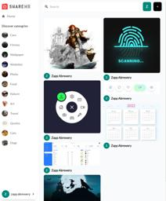|
|27| [Crowdfunding blockchain](https://github.com/xml12333/reactJS/tree/27-crowdfunding-blockchain)| [Demo](https://nikt-crowdfunding-blockchain.netlify.app/)| 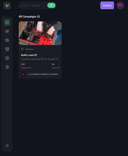|
|28| [Chat gpt](https://github.com/xml12333/reactJS/tree/28-chat-gpt)| [Demo](https://nikt-chat-gpt.netlify.app/)| |
|29| [Ai image generator](https://github.com/xml12333/reactJS/tree/29-ai-image-generator)| [Demo](https://nikt-ai-image-generator.netlify.app/)| |
|30| [Youtube clone](https://github.com/xml12333/reactJS/tree/30-youtube-clone)| [Demo](https://nikt-youtube-clone.netlify.app/)| |
|31| [Fitnes exercises](https://github.com/xml12333/reactJS/tree/31-fitnes-exercises)| [Demo](https://nikt-fitnes-exercises.netlify.app/)| |
|32| [Spotify clone](https://github.com/xml12333/reactJS/tree/32-spotify-clone)| [Demo](https://nikt-spotify-clone.netlify.app/)| |
|33| [Refine dashboard](https://github.com/xml12333/reactJS/tree/33-refine-dashboard)| [Demo](https://nikt-refine-dashboard.netlify.app/)| |
|34| [Keyword extractor](https://github.com/xml12333/reactJS/tree/34-keyword-extractor)| [Demo](https://nikt-keyword-extractor.netlify.app/)| |
|35| [3d portfolio](https://github.com/xml12333/reactJS/tree/35-3d-portfolio)| [Demo](https://nikt-3d-portfolio.netlify.app/)| |
|36| [3d ai](https://github.com/xml12333/reactJS/tree/36-3d-ai)| [Demo](https://nikt-3d-ai.netlify.app/)| 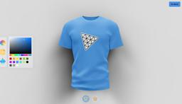|
|37| [Article ai](https://github.com/xml12333/reactJS/tree/37-article-ai)| [Demo](https://nikt-article-ai.netlify.app/)| |
|38| [Promtopia](https://github.com/xml12333/reactJS/tree/38-promtopia)| [Demo](https://nikt-promtopia.netlify.app/)| 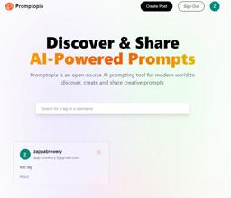|
|39| [Car showcase](https://github.com/xml12333/reactJS/tree/39-car-showcase)| [Demo](https://nikt-car-showcase.netlify.app/)| |
|40| [Dribble clone](https://github.com/xml12333/reactJS/tree/40-dribble-clone)| [Demo](https://nikt-dribble-clone.netlify.app/)| 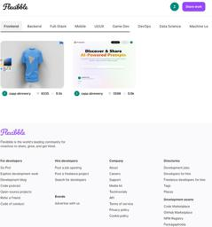|
|41| [Real estate with ai](https://github.com/xml12333/reactJS/tree/41-real-estate-with-AI)| [Demo](https://nikt-real-estate-with-AI.netlify.app/)| |
|42| [Etan portfolio](https://github.com/xml12333/reactJS/tree/42-etan-portfolio)| [Demo](https://nikt-etan-portfolio.netlify.app/)| |
